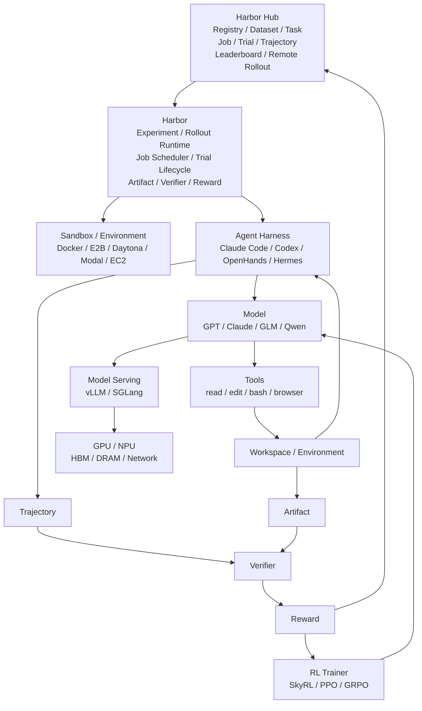

# Harbor / Harbor Hub 平台全景分析

## 1. 一句话理解 Harbor

Harbor 是一个面向 AI Agent 的**环境驱动型评测、Rollout 与优化框架**。

它解决的核心问题不是“怎么造一个 Agent”，而是：

> 怎么把不同 Agent、Model 放进统一、可复现的 Sandbox 环境里执行真实任务，记录全过程，自动判分，并规模化产生 Rollout 数据。

Harbor Hub 则是 Harbor 之上的远端平台：

> 负责 Task / Dataset 发布、版本管理、实验结果存储、Trajectory 浏览、Leaderboard、团队协作以及 Hosted Remote Rollout。

最简化关系：

```text
Harbor
= 本地/分布式执行引擎

Harbor Hub
= Registry + Experiment Control Plane
```

---

# 2. Harbor 的发展历程

## 2.1 Terminal-Bench：起点

Harbor 并不是从零开始设计的，它来自 Terminal-Bench。

Terminal-Bench 最初解决的是：

```text
给 Agent 一台 Linux 电脑
        ↓
给它一个真实任务
        ↓
让它使用 Terminal 完成任务
        ↓
自动测试它到底做对没有
```

与传统 LLM Benchmark 不同，它不是：

```text
Prompt → Answer → 对答案
```

而是：

```text
任务说明
+
真实执行环境
+
文件 / 软件 / Repo
+
Agent 操作过程
+
自动测试程序
```

这里已经形成 Harbor 最核心的思想：

> 用“可执行环境”评估 Agent，而不是只比较模型最终文本答案。

---

## 2.2 Dataset Registry：开始统一 Benchmark

Benchmark 增多后，很快会遇到：

```text
SWE-Bench 一套 Harness
Terminal-Bench 一套 Harness
AppWorld 一套 Harness
其他 Benchmark 又是一套
```

如果希望比较：

```text
Claude Code
Codex
OpenHands
自研 Agent
```

就需要分别适配大量 Benchmark。

于是演进出 Dataset Registry：

```text
不同 Benchmark
       ↓
统一 Task 结构
       ↓
统一 Runner
       ↓
不同 Agent 都可以运行
```

这也是后续 Harbor Hub Registry 的前身。

---

## 2.3 Harbor 独立：从 Benchmark Runner 变成通用 Harness

Harbor 独立后，目标不再只是 Terminal-Bench。

核心问题变成：

```text
① Eval 如何扩展到大量云 Sandbox

② Agent Rollout 如何用于
   Eval / SFT / RL / Prompt Optimization

③ 不同 Agent / Benchmark
   如何统一接口
```

于是 Harbor 开始形成：

```text
Task abstraction
Environment abstraction
Agent adapter
Job / Trial
Trajectory
Verifier
Reward
```

从这里开始：

```text
Terminal-Bench
= 一个 Benchmark

Harbor
= 一个通用 Agent Rollout / Evaluation Runtime
```

---

## 2.4 Harbor Hub：从 Registry 走向控制面

随后 Hub 的职责不断扩展：

```text
最初：
Task / Dataset Registry

然后：
Job / Trial 上传与浏览

再然后：
Trajectory Viewer
Leaderboard
Organization
Secret
Remote Rollout

现在：
越来越接近 Agent Rollout Control Plane
```

因此 Harbor 整体演进可以概括为：

```text
Terminal Agent Benchmark
        ↓
Benchmark Registry
        ↓
General Agent Harness
        ↓
Rollout Runtime
        ↓
Trajectory / Reward Infrastructure
        ↓
Harbor Hub
        ↓
Remote Rollout / Agent Training Infrastructure
```

---


# 3. Harbor / Harbor Hub 全景架构图

先用一张图把整个 Harbor 体系放到同一个坐标系里：

```text
┌──────────────────────────────────────────────────────────────────────────────┐
│                              Harbor Hub                                      │
│                   Asset / Experiment / Control Plane                         │
│                                                                              │
│  Package Registry   Dataset / Task   Job / Trial   Trajectory   Leaderboard │
│  Organization       Secrets          Sharing       Remote Rollout            │
└───────────────────────────────┬──────────────────────────────────────────────┘
                                │
                                │ Job / Trial / Package / Result
                                ▼
┌──────────────────────────────────────────────────────────────────────────────┐
│                                Harbor                                        │
│                     Experiment / Rollout Runtime                             │
│                                                                              │
│  Job Scheduler ──→ Trial Lifecycle ──→ Environment Adapter                   │
│                         │                 │                                   │
│                         │                 ├─ Docker                           │
│                         │                 ├─ E2B                              │
│                         │                 ├─ Daytona                          │
│                         │                 ├─ Modal                            │
│                         │                 └─ EC2 / Cloud Sandbox              │
│                         │                                                    │
│                         ├─ Agent Adapter                                     │
│                         ├─ Timeout / Retry                                   │
│                         ├─ Trajectory Collector                              │
│                         ├─ Artifact Collector                                │
│                         ├─ Verifier                                          │
│                         └─ Reward                                            │
└───────────────────────────────┬──────────────────────────────────────────────┘
                                │
                                ▼
┌──────────────────────────────────────────────────────────────────────────────┐
│                         Agent Harness Layer                                  │
│                                                                              │
│            Claude Code / Codex / OpenHands / Hermes / Custom Agent          │
│                                                                              │
│       Context ── Planning ── Tool Selection ── Retry / Loop ── Memory        │
│                                │                                             │
│                                ▼                                             │
│                              Model                                           │
│                       GPT / Claude / GLM / Qwen                              │
│                                │                                             │
│                         Tool Decision                                        │
│                                │                                             │
│                  ┌─────────────┼─────────────┐                               │
│                  ▼             ▼             ▼                               │
│                read          edit           bash / browser                   │
│                  └─────────────┬─────────────┘                               │
│                                ▼                                             │
│                         Environment / Workspace                              │
│                                │                                             │
│                          Observation                                         │
│                                └────────────→ Model                           │
└───────────────────────────────┬──────────────────────────────────────────────┘
                                │
                     Trajectory + Artifact
                                │
                                ▼
                        ┌───────────────┐
                        │   Verifier    │
                        └───────┬───────┘
                                ▼
                             Reward
                                │
                  ┌─────────────┴─────────────┐
                  ▼                           ▼
             Harbor Hub                  RL Trainer
                                         SkyRL / GRPO
                                             │
                                             ▼
                                          Policy
                                             │
                                             ▼
                                            Model
```

这张图里最重要的边界只有四个：

```text
Harbor Hub
= 管很多实验、资产和结果

Harbor
= 管一次 Trial / Rollout 怎么运行

Claude Code / Codex
= 管一次 Agent 内部怎么解决任务

vLLM / SGLang
= 管一次模型推理怎么高效执行
```

## 3.1 Mermaid 版本



---

# 5. Harbor 的整体定位

Harbor 可以理解为四层系统中的中间层：

```text
L3  Harbor Hub
────────────────────────────
资产 / 实验 / 控制面

L2  Harbor
────────────────────────────
Rollout / Evaluation Runtime

L1  Agent Harness
────────────────────────────
Claude Code / Codex / OpenHands

L0  Model + Tool + Compute
────────────────────────────
GPT / Claude / GLM
vLLM / SGLang
GPU / NPU
```

Harbor 不是 Agent，也不是 Model Serving。

它位于二者之外，负责：

```text
Task
Environment
Trial
Trajectory
Artifact
Verifier
Reward
```

---

# 5. Harbor 核心对象模型

Harbor 的对象可以统一成三类：

```text
资产对象
Package → Dataset → Task

执行对象
Job → Trial

结果对象
Trajectory / Artifact → Verifier → Reward
```

但注意：

> 这不是严格的单向父子链。

更准确的结构是：

```text
             Package Registry
             /              \
        Dataset             Task
            \                /
             \              /
              \            /
                Job
                 │
             N × Trial
                 │
       ┌─────────┴─────────┐
       ▼                   ▼
  Trajectory            Artifact
       │                   │
       └─────────┬─────────┘
                 ▼
              Verifier
                 │
                 ▼
               Reward
```

---

# 6. Package：版本化发布单元

Package 解决的问题是：

> 我运行的到底是哪一个版本的 Task / Dataset？

例如：

```text
my-org/my-benchmark@1.0
my-org/task-123@v2
```

Package 一般承载：

```text
Organization
Name
Version
Metadata
Content Identity
Registry Distribution
```

它更像：

```text
Docker Image Tag
Python Package Version
HuggingFace Revision
```

核心价值：

> 保证 Task / Dataset 可以被稳定分发和复现。

---

# 7. Dataset：一套题

Dataset 最简单的理解：

> 一套考试题。

例如：

```text
SWE-Bench Verified
├─ Task 001
├─ Task 002
├─ Task 003
...
└─ Task 500
```

Dataset 本身不负责执行。

它只负责定义：

```text
“这次我要跑哪些 Task”
```

Dataset 可以代表：

```text
Benchmark
Regression Set
Training Set
Hard Case Set
Composite Benchmark
```

一个 Task 也可以被多个 Dataset 引用。

---

# 8. Task：Harbor 最重要的资产

Task 可以理解成：

> 一道真正可以进入电脑完成的题。

典型结构：

```text
task/
│
├─ instruction.md
│   └─ 给 Agent 的任务
│
├─ task.toml
│   └─ Timeout / Resource / Metadata
│
├─ environment/
│   └─ Dockerfile / Runtime
│
├─ tests/
│   └─ 自动判题脚本
│
└─ solution/
    └─ Reference Solution
```

Task 的核心抽象：

```text
Instruction
+
Environment
+
Verifier / Test
```

因此它不是传统：

```text
Question → Answer
```

而是：

```text
Instruction
→ 启动一个世界
→ Agent 进入这个世界
→ 操作这个世界
→ 验证最终世界状态
```

所以：

> Task 本质上是一个 Executable Environment。

---

# 9. Job：一次实验计划

Job 可以理解成：

> 一场考试安排。

例如：

```text
Dataset:
SWE-Bench 500 题

Agent:
Claude Code
Codex

Model:
Claude
GPT

Attempts:
5
```

Harbor 会将 Job 展开：

```text
Task1 × Claude Code × Claude × attempt1
Task1 × Claude Code × Claude × attempt2
...
Task1 × Codex × GPT × attempt1
...
Task500 × ...
```

所以：

```text
Job
= 一批 Trial 的实验定义
```

Job 主要回答：

> 这一次到底要让哪些 Agent / Model 跑哪些 Task？

---

# 10. Trial：Harbor 最核心的执行原子

Trial 是整个 Harbor 最重要的对象。

> Trial = 一个 Agent 对一个 Task 的一次真实尝试。

可以近似理解为：

```text
Trial
=
Task
× Agent
× Model
× Sandbox
× Config
× Attempt
```

例如：

```text
Task:
fix-race-condition

Agent:
Claude Code

Model:
Claude

Sandbox:
Docker

Attempt:
1
```

这就是一个 Trial。

换句话说：

```text
一次 Eval
一次 Agent Execution
一次 Rollout
```

最终都可以落到 Trial。

---

# 11. Trial 内部生命周期

一个 Trial 可以拆成：

```text
Task
 ↓
Environment
 ↓
Agent
 ↓
Model
 ↕
Tool
 ↓
Artifact
 ↓
Verifier
 ↓
Reward
```

更完整：

```text
① 创建 Sandbox
        ↓
② 加载 Environment
        ↓
③ 启动 Agent
        ↓
④ 给 Agent Instruction
        ↓
⑤ Agent 调用 Model
        ↓
⑥ Model 决定 Tool Action
        ↓
⑦ Tool 操作 Environment
        ↓
⑧ 返回 Observation
        ↓
⑨ Model ↔ Tool 循环
        ↓
⑩ Agent 完成
        ↓
⑪ 收集 Trajectory / Artifact
        ↓
⑫ Verifier 判定
        ↓
⑬ 产生 Reward
```

---

# 12. Environment：给 Agent 一台电脑

例如 Task 是修 Python Bug。

Harbor 首先准备：

```text
Ubuntu Sandbox
│
├─ Python
├─ Git
├─ pytest
├─ Source Code
└─ Task Dependencies
```

可以区分两个概念：

```text
Sandbox Provider
= “电脑从哪里来”

Environment
= “这台电脑里面是什么”
```

例如：

```text
Docker
E2B
Daytona
Modal
EC2
...
```

负责提供 Sandbox。

Harbor 则统一管理 Environment 生命周期。

---

# 13. Agent：真正做题的软件

Environment 准备完成后，Harbor 启动：

```text
Claude Code
Codex
OpenHands
Hermes
Custom Agent
```

并将 Task instruction 交给它。

此时：

```text
Harbor
负责启动 Agent、记录实验、控制生命周期

Agent
负责真正解决任务
```

---

# 14. Model：Agent 的大脑

一个非常重要的区分：

```text
Claude Code ≠ Claude Model

Codex Agent ≠ GPT Model
```

典型调用关系：

```text
Harbor
 ↓
Claude Code
 ↓
Claude Model
```

或者：

```text
Harbor
 ↓
Custom Agent
 ↓
GLM
```

因此：

```text
Agent
= 决定“怎么做事情”

Model
= 决定“下一步想干什么”
```

---

# 15. Tool：Agent 的手

Agent 内部真正运行的是：

```text
Model
 ↓
“先看看目录”
 ↓
Tool: ls
 ↓
Environment 返回结果
 ↓
Model
 ↓
“看看 foo.py”
 ↓
Tool: read
 ↓
Model
 ↓
Tool: edit
 ↓
Model
 ↓
Tool: pytest
 ↓
...
```

核心循环：

```text
        Model
          │
          ▼
      Tool Call
          │
          ▼
    Environment
          │
          ▼
     Observation
          │
          └──────→ Model
```

这个循环可能发生几十次甚至几百次。

---

# 16. Harbor 与 Claude Code / Codex 的边界

最容易混淆的是：

```text
Harbor
和
Claude Code / Codex
都可能被叫 Harness
```

但其实处于不同层。

```text
Claude Code / Codex
= Agent Harness

Harbor
= Experiment / Rollout Harness
```

Claude Code / Codex 负责：

```text
Planning
Context Management
Tool Selection
Model Calling
Retry
Loop
```

Harbor 负责：

```text
Task
Sandbox
Trial Lifecycle
Timeout
Artifact
Trajectory
Verifier
Reward
Experiment Aggregation
```

一句话：

> Agent Harness 负责“一次 Agent 怎么工作”。

> Harbor 负责“一次 Rollout 怎么运行和评测”。

---

# 17. Trajectory：Agent 工作全过程

Trajectory 可以理解成：

> Agent 做题全过程的录像。

例如：

```text
Step 1
Model:
先运行测试

Tool:
pytest

Observation:
FAILED

Step 2
Model:
看看 foo.py

Tool:
read foo.py

...

Step 18
Tool:
pytest

Observation:
18 passed
```

Trajectory 可以包含：

```text
Message
Reasoning
Tool Call
Tool Result
Observation
Token Usage
Timing
Error
Sub-agent activity
```

它不仅用于 Debug，还可以用于：

```text
Failure Analysis
Agent Behavior Analysis
SFT
Agentic RL
Reward Modeling
Trajectory Mining
Process Reward
```

---

# 18. Artifact：Agent 最终留下的结果

Trajectory 是过程。

Artifact 是结果。

例如：

```text
Trajectory
= Agent 如何一步步改代码

Artifact
= Agent 最终改好的代码
```

Artifact 可以是：

```text
patch.diff
output.json
代码目录
生成文件
报告
模型产物
```

所以：

```text
Trajectory
= 录像

Artifact
= 最终作品
```

---

# 19. Verifier：真正的阅卷老师

Agent 说：

```text
“任务完成”
```

并不等于真的完成。

因此 Harbor 运行 Verifier。

Verifier 可以是：

```text
pytest
shell script
custom program
LLM Judge
Agent Judge
```

例如：

```text
Agent 完成修改
      ↓
pytest
      ↓
18 passed
      ↓
reward = 1
```

Verifier 的关键原则：

> Agent 自己不能决定自己是否成功。

---

# 20. Separate Verifier

为了防止 Agent 偷看测试或修改评分逻辑，可以将：

```text
Agent Sandbox
和
Verifier Sandbox
```

完全隔离。

例如：

```text
Agent Environment
────────────────
项目代码
Agent Tools
Model API Key


Verifier Environment
────────────────
Hidden Tests
Private Grader
Judge Prompt
Verifier Dependencies
```

这样可以降低：

```text
Reward Hacking
Benchmark Leakage
Verifier Tampering
```

---

# 21. Reward：最终训练 / 评测信号

最简单：

```text
成功 = 1
失败 = 0
```

也可以多维：

```json
{
  "correctness": 0.95,
  "quality": 0.80,
  "efficiency": 0.70,
  "reward": 0.86
}
```

Reward 可以分成：

```text
Outcome Reward
结果是否正确

Process Reward
过程是否合理

Efficiency Reward
Token / Step / Duration 是否合理

Behavior Reward
是否违规使用工具等
```

---

# 22. 一次完整 Trial 长什么样

```text
Trial #10021
────────────────────

Task
fix-race-condition

Agent
Claude Code

Model
Claude

Environment
Docker

↓

38 Agent Steps

↓

Trajectory
38 steps

Artifact
3 files

↓

Verifier
pytest + custom grader

↓

Reward
1.0

↓

Metrics
Tokens
Cost
Duration
Tool Calls
Errors
```

这就是 Harbor 最核心的数据生产单元。

---

# 23. Harbor Hub 的定位

如果说：

```text
Harbor
= 生产 Trial 的机器
```

那么：

```text
Harbor Hub
= 管理 Trial 和资产的平台
```

可以近似理解为：

```text
Harbor Hub

≈ Benchmark Registry
+ Experiment Tracking
+ Trajectory Platform
+ Leaderboard
+ Rollout Control Plane
```

它主要管理：

```text
Package
Dataset
Task
Job
Trial
Trajectory
Artifact
Reward
Leaderboard
Organization
Secret
Remote Rollout
```

---

# 24. Harbor 与 Harbor Hub 的职责边界

| Harbor | Harbor Hub |
|---|---|
| Task Runtime | Task / Dataset Registry |
| Sandbox Adapter | Package Registry |
| Agent Adapter | Job / Trial Storage |
| Job Runner | Trajectory Browser |
| Trial Runner | Leaderboard |
| Artifact Collection | Organization |
| Verifier | Secrets |
| Reward | Remote Rollout |
| Local Viewer | Web UI / API |

架构上可以简单理解：

```text
Harbor
= Runtime / Data Plane

Harbor Hub
= Control Plane / Registry
```

---

# 25. Harbor Hub 对象关系

```text
        Package
          │
     ┌────┴────┐
     ▼         ▼
 Dataset      Task
     │         │
     └────┬────┘
          │
          ▼
         Job
          │
      N × Trial
          │
    ┌─────┼───────┐
    ▼     ▼       ▼
Trajectory Artifact Logs
          │
          ▼
       Verifier
          │
          ▼
        Reward
          │
          ▼
        Metrics
          │
          ▼
     Leaderboard
```

通俗映射：

| Harbor 对象 | 通俗理解 |
|---|---|
| Package | 试卷版本包 |
| Dataset | 一套试卷 |
| Task | 一道题 |
| Job | 一场考试安排 |
| Trial | 某考生做某题的一次尝试 |
| Trajectory | 做题录像 |
| Artifact | 最终答卷 |
| Verifier | 阅卷老师 |
| Reward | 分数 |
| Leaderboard | 成绩排名 |

---

# 26. Remote Rollout：Hub 的关键变化

过去：

```text
本机

harbor run
 ↓
本地 Sandbox
 ↓
Job
 ↓
上传 Hub
```

现在逐渐演进成：

```text
Harbor Hub
 ↓
提交 Job
 ↓
Remote Rollout
 ↓
Cloud Sandbox
 ↓
Agent
 ↓
Model
 ↓
Trial
 ↓
Trajectory / Reward
 ↓
Harbor Hub
```

这意味着 Hub 不再只是结果网站，而是越来越接近：

> Agent Rollout Control Plane。

---

# 27. Harbor 与 Sandbox 的边界

```text
Harbor
  │
  │ Environment API
  ▼
┌─────────────────────┐
│ Sandbox Provider    │
├─────────────────────┤
│ Docker              │
│ E2B                 │
│ Daytona             │
│ Modal               │
│ EC2                 │
│ ...                 │
└──────────┬──────────┘
           │
           ▼
        Linux VM /
        Container
```

所以：

```text
Sandbox
= 提供隔离运行环境

Harbor
= 管理 Sandbox 生命周期并在其上执行 Trial
```

---

# 28. Harbor 与 vLLM / SGLang 的边界

二者不是一层。

```text
Harbor
Rollout Layer
   │
   ▼
Claude Code / Codex
   │
   ▼
LLM API
   │
   ▼
vLLM / SGLang
Inference Engine
   │
   ▼
GPU / NPU Cluster
```

Harbor 关心：

```text
Task
Trial
Environment
Trajectory
Reward
```

vLLM / SGLang 关心：

```text
Prefill
Decode
Batching
KV Cache
Scheduling
Tensor Parallel
Throughput
```

因此：

```text
Harbor
= Agent Rollout Infra

vLLM / SGLang
= Model Inference Infra
```

---

# 29. Harbor 与 RL Trainer 的边界

以 SkyRL 一类系统为例：

```text
            RL Trainer
      ┌───────────────────┐
      │ PPO / GRPO        │
      │ Advantage         │
      │ Gradient Update   │
      │ Policy Update     │
      └─────────┬─────────┘
                │ Policy
                ▼
              Model
                │
                ▼
              Harbor
          Rollout Runtime
                │
                ▼
               Task
                │
                ▼
       Agent + Environment
                │
                ▼
           Trajectory
                │
                ▼
             Reward
                │
                └────────────→ RL Trainer
```

简单说：

```text
Harbor
负责“采样”

RL Trainer
负责“学习”
```

即：

```text
Harbor
= Rollout Plane

SkyRL 等
= Training Plane
```

---

# 30. Harbor 对 Agentic RL 的价值

传统 Eval：

```text
Task
 ↓
Agent
 ↓
Pass / Fail
```

Harbor：

```text
Task
 ↓
Environment
 ↓
Agent Rollout
 ↓
Trajectory
 ↓
Reward
```

而 RL 需要：

```text
State / Context
Action
Trajectory
Reward
```

所以可以近似理解：

```text
Harbor Trial
≈ RL Rollout
```

Harbor 的价值在于：

```text
高并发产生 Trial
标准化记录 Trajectory
标准化产生 Reward
统一管理 Environment
```

---

# 31. Harbor 真正的技术价值

Harbor 的核心价值不是：

> 某一个 Agent 跑得更快。

而是：

> 把 Agent 实验标准化。

```text
Claude Code
Codex
OpenHands
自研 Agent
     │
     ▼
   Harbor
     │
┌────┼─────────────┐
▼    ▼             ▼
TBench SWE-Bench  自研 Task
     │
     ▼
统一 Environment API
     │
     ▼
    Trial
     │
┌────┴────┐
▼         ▼
Trajectory Reward
```

于是才能公平研究：

```text
同 Model，不同 Harness

同 Agent，不同 Model

同 Agent，不同 Sandbox

同 Task，不同 Prompt

同 Model，不同 Tool Strategy
```

---

# 32. Harbor 不是什么

## Harbor ≠ Agent

Harbor 不负责决定：

```text
下一步读哪个文件
下一步执行什么命令
怎么规划任务
```

这是 Claude Code / Codex 等 Agent Harness 的工作。

---

## Harbor ≠ Sandbox

Harbor 不等于 Docker / E2B / Daytona。

它通过统一接口调用这些 Sandbox Provider。

---

## Harbor ≠ Model Serving

Harbor 不负责：

```text
Prefill
Decode
KV Cache
Batching
TP / DP
```

这些是 vLLM / SGLang 等推理引擎的工作。

---

## Harbor ≠ RL Trainer

Harbor 更偏：

```text
Task
→ Rollout
→ Trajectory
→ Reward
```

训练系统负责：

```text
Trajectory + Reward
→ Advantage
→ Gradient
→ Policy Update
```

---

# 33. 整体 Agent Infra 分层

```text
L5  Asset / Control Plane
────────────────────────────────
Harbor Hub
Dataset / Task / Job / Trial
Leaderboard / Remote Rollout


L4  Rollout / Evaluation Plane
────────────────────────────────
Harbor
Scheduler / Environment
Trajectory / Artifact
Verifier / Reward


L3  Agent Harness Plane
────────────────────────────────
Claude Code
Codex
OpenHands
Hermes
Custom Agent


L2  Agent Runtime Plane
────────────────────────────────
Context
Planning
Tool Calling
Memory
Retry


L1  Model Serving Plane
────────────────────────────────
vLLM
SGLang
TensorRT-LLM
Omni-Infer


L0  Compute Plane
────────────────────────────────
GPU / NPU
HBM / DRAM
KV Cache
Network
Storage
```

如果加入 RL：

```text
          RL Trainer
              ▲
              │
      Trajectory + Reward
              │
            Harbor
```

---

# 34. 统一 Harbor 的对象与边界

## 33.1 对象统一

```text
资产对象
Package → Dataset → Task

执行对象
Job → Trial

结果对象
Trajectory / Artifact → Verifier → Reward
```

最终核心关系：

```text
Task
 +
Agent
 +
Model
 +
Environment
 ↓
Trial
 ↓
Trajectory + Artifact
 ↓
Verifier
 ↓
Reward
```

---

## 33.2 边界统一

| 层 | 代表 | 负责什么 |
|---|---|---|
| Harbor Hub | Hub | 管资产、实验、结果、远程调度 |
| Harbor | Runtime | 管 Trial / Rollout 生命周期 |
| Agent Harness | Claude Code、Codex | 管一次 Agent 内部怎么工作 |
| Model Serving | vLLM、SGLang | 管模型怎么高效推理 |
| Sandbox | Docker、E2B、Daytona | 提供隔离执行环境 |
| RL Trainer | SkyRL 等 | 用 Reward / Trajectory 更新模型 |

---

# 35. 最终统一架构图

```text
                 Harbor Hub
        ┌──────────────────────────┐
        │ Registry                 │
        │ Dataset / Task           │
        │ Job / Trial              │
        │ Trajectory               │
        │ Leaderboard              │
        │ Remote Rollout           │
        └────────────┬─────────────┘
                     │
                     ▼
                  Harbor
          Experiment / Rollout
                Runtime
                     │
        ┌────────────┴────────────┐
        │                         │
        ▼                         ▼
    Sandbox                    Agent
Docker / E2B              Claude Code
Daytona / Modal           Codex
        │                 OpenHands
        │                     │
        │                  Model
        │                     │
        │             GPT / Claude / GLM
        │                     │
        └──────── Tool ◄──────┘
                     │
                     ▼
                 Workspace
                     │
            ┌────────┴────────┐
            ▼                 ▼
        Trajectory         Artifact
                              │
                              ▼
                          Verifier
                              │
                              ▼
                           Reward
                              │
                  ┌───────────┴───────────┐
                  ▼                       ▼
             Harbor Hub               RL Trainer
```

---

# 36. 最终心智模型

只记住五句话即可：

> **Task 是“世界 + 任务 + 判题规则”。**

> **Agent 是进入这个世界完成任务的人。**

> **Trial 是 Agent 在这个世界里完整执行一次。**

> **Trajectory 是这次经历，Reward 是最终评价。**

> **Harbor 负责批量制造 Trial；Harbor Hub 负责管理、共享和规模化这些 Trial。**

因此 Harbor 真正的技术内核是：

```text
Executable Environment
        +
Agent Rollout
        +
Trajectory
        +
Verifier / Reward
```

而 Harbor Hub 则进一步把这些能力平台化：

```text
Registry
+
Experiment Tracking
+
Trajectory Management
+
Leaderboard
+
Remote Rollout
```

最终可以把整个体系浓缩成一句话：

> **Hub 管很多实验，Harbor 管一次 Rollout，Agent Harness 管一次 Agent 行为，Model Serving 管一次模型推理，Sandbox 提供世界，Verifier 给结果打分。**
